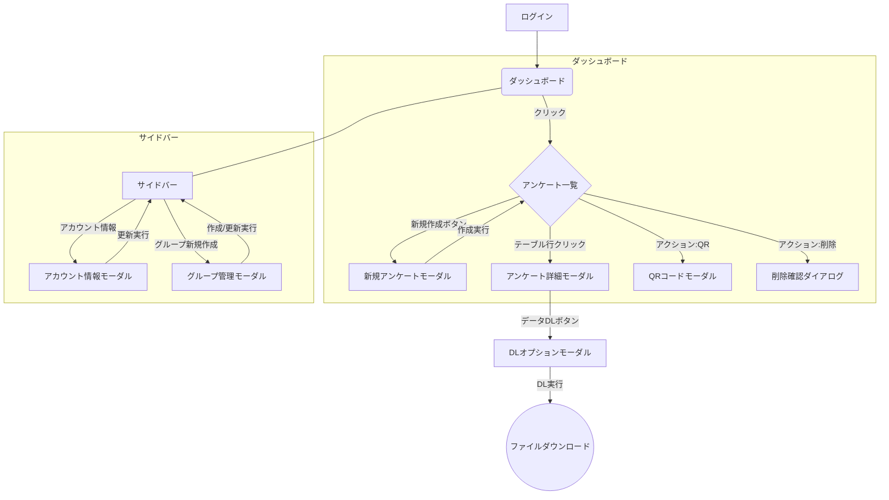

# 画面フロー定義書: SpeedAd - アンケート管理ダッシュボード

## 1. 概要

このドキュメントは、「SpeedAd - アンケート管理ダッシュボード」におけるユーザーの操作に伴う画面遷移およびモーダル表示のフローを定義します。

## 2. 全体フロー図（概念）

## 3. 主要フロー詳細

### 3.1. 初期表示

1.  ユーザーがログインに成功すると、**アンケート管理ダッシュボード**が表示されます。
2.  システムは、ユーザーが現在選択しているグループに紐づくアンケートの一覧を非同期で取得し、メインコンテンツエリアのテーブルに表示します。
3.  サイドバーには、ユーザー情報と所属グループの情報が表示されます。

### 3.2. アンケートの新規作成

1.  ユーザーがメインコンテンツの「アンケート新規作成」ボタンをクリックします。
2.  **新規アンケート作成モーダル** (`newSurveyModal`) が表示されます。
3.  ユーザーが必要事項（アンケート名、会期など）を入力し、「作成する」ボタンをクリックします。
4.  入力内容のバリデーションが実行されます。
    - エラーがある場合: モーダルは閉じず、エラー箇所とメッセージを表示します。
    - エラーがない場合: 新規アンケートが作成された旨のトースト通知が表示され、モーダルが閉じます。
5.  アンケート一覧が自動的に更新され、新しく作成されたアンケートがテーブルに追加されます。

### 3.3. アンケート詳細の確認

1.  ユーザーがアンケート一覧テーブルのいずれかの行をクリックします。
2.  **アンケート詳細モーダル** (`surveyDetailsModal`) が表示されます。
3.  モーダルには、クリックされたアンケートの全ての情報（ID、ステータス、回答数、メモなど）が読み取り専用で表示されます。
4.  ユーザーは「閉じる」ボタンまたはEscキーでモーダルを閉じます。

### 3.4. QRコードの表示とダウンロード

1.  ユーザーがアンケート一覧テーブルのアクション列にある「QRコード」アイコンをクリックします。
2.  **QRコードモーダル** (`qrCodeModal`) が表示されます。
3.  モーダルには、該当アンケートの回答ページのURLと、それに対応するQRコード画像が表示されます。
4.  ユーザーは「URLコピー」ボタンでURLをクリップボードにコピーしたり、「QRコードをダウンロード」ボタンで画像ファイルを保存したりできます。

### 3.5. 回答データのダウンロード

1.  ユーザーはまず「3.3. アンケート詳細の確認」フローを実行し、**アンケート詳細モーダル**を開きます。
2.  モーダル内の「データダウンロード」ボタンをクリックします。
3.  **データダウンロードオプションモーダル** (`downloadOptionsModal`) が表示されます。
4.  ユーザーはダウンロードするデータの種類（回答データ、名刺画像など）や期間を選択します。
5.  「ダウンロード」ボタンをクリックすると、指定された条件でデータが生成され、ファイルのダウンロードが開始されます。

### 3.6. アカウント情報の編集

1.  ユーザーがサイドバーの「アカウント情報」リンクをクリックします。
2.  **アカウント情報モーダル** (`accountInfoModal`) が表示されます。
3.  モーダルには、現在のユーザー情報がフォームに投入された状態で表示されます。
4.  ユーザーは情報を編集し、「更新する」ボタンをクリックします。
5.  バリデーションチェック後、情報が更新され、成功のトースト通知と共にモーダルが閉じます。

### 3.7. グループの管理

1.  **(切替)** ユーザーがサイドバーのグループ選択ドロップダウンから別のグループを選び、「切替」ボタンをクリックします。
    - アンケート一覧が、新しく選択されたグループに紐づくものに更新されます。
2.  **(新規作成/編集)** ユーザーが「グループ新規作成」ボタンをクリック（または既存グループの編集を選択）します。
    - **グループ管理モーダル** (`newGroupModal`) が表示されます。
    - ユーザーはグループ名や説明を入力し、メンバーの追加・削除を行います。
    - 「作成する」または「更新する」ボタンをクリックすると、情報が保存され、モーダルが閉じます。

